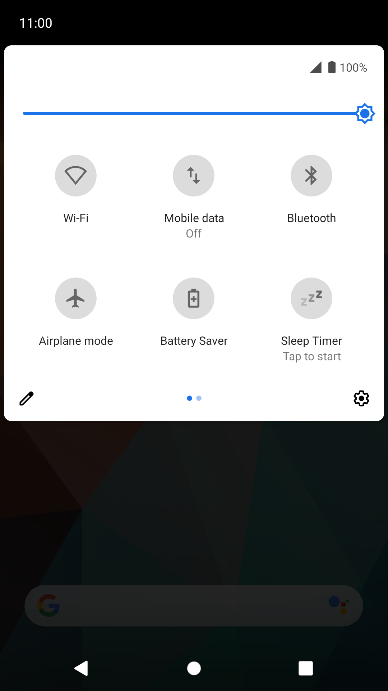
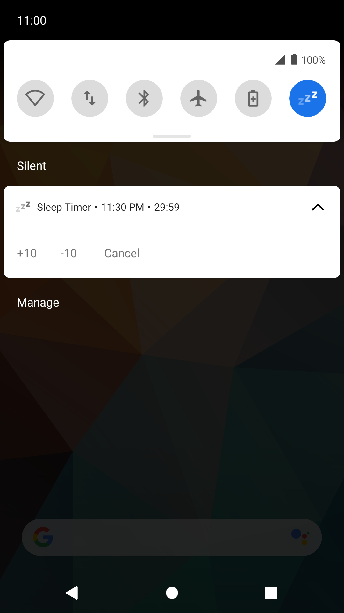

# Sleep Timer 

| Quick Settings Tile | Notification |
|---|---|
|  |  |

#### APIs

- [Tile](https://developer.android.com/reference/android/service/quicksettings/Tile.html) and [TileService](https://developer.android.com/reference/android/service/quicksettings/TileService): Quick Settings Tile
- [Notification.Builder.setTimeoutAfter(durationMs)](https://developer.android.com/reference/android/app/Notification.Builder#setTimeoutAfter(long)): set notification timeout.
- [Notification.Builder.setDeleteIntent(intent)](https://developer.android.com/reference/android/app/Notification.Builder#setDeleteIntent(android.app.PendingIntent)): set deletion action.
- [AudioManager.adjustStreamVolume(STREAM_MUSIC, ADJUST_LOWER, flags)](https://developer.android.com/reference/android/media/AudioManager#adjustStreamVolume(int,%20int,%20int)): lower media volume.
- [AudioManager.requestAudioFocus(focusRequest)](https://developer.android.com/reference/android/media/AudioManager#requestAudioFocus(android.media.AudioFocusRequest)): stop current media stream.
- [AudioManager.setStreamVolume(STREAM_MUSIC, index, flags)](https://developer.android.com/reference/android/media/AudioManager#setStreamVolume(int,%20int,%20int)): restore initial volume.
- [AudioManager.abandonAudioFocusRequest(focusRequest)](https://developer.android.com/reference/android/media/AudioManager#abandonAudioFocusRequest(android.media.AudioFocusRequest)): release audio focus.

# License

    Copyright 2020 Simon Marquis

    Licensed under the Apache License, Version 2.0 (the "License");
    you may not use this file except in compliance with the License.
    You may obtain a copy of the License at

       http://www.apache.org/licenses/LICENSE-2.0

    Unless required by applicable law or agreed: in writing, software
    distributed under the License is distributed on an "AS IS" BASIS,
    WITHOUT WARRANTIES OR CONDITIONS OF ANY KIND, either express or implied.
    See the License for the specific language governing permissions and
    limitations under the License.