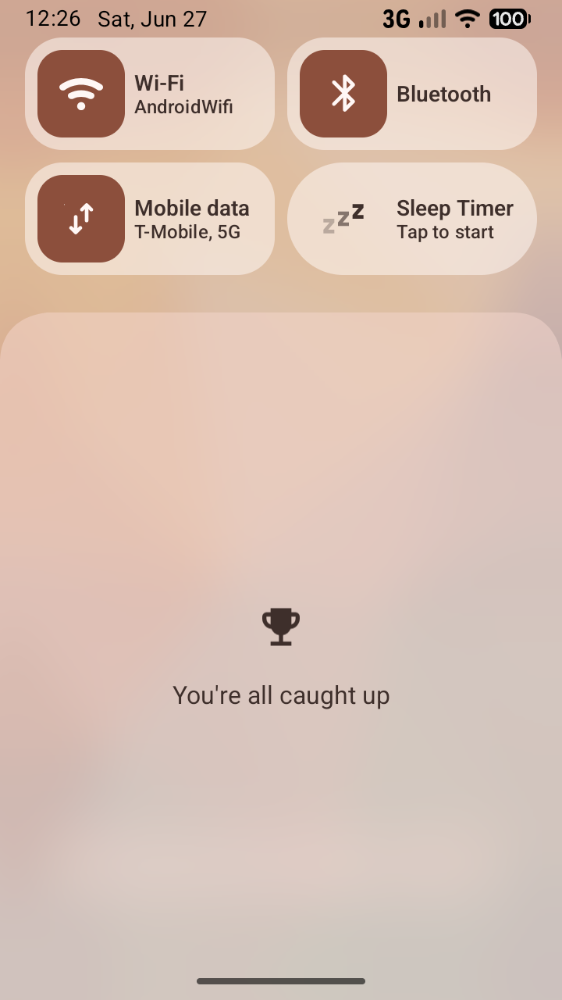
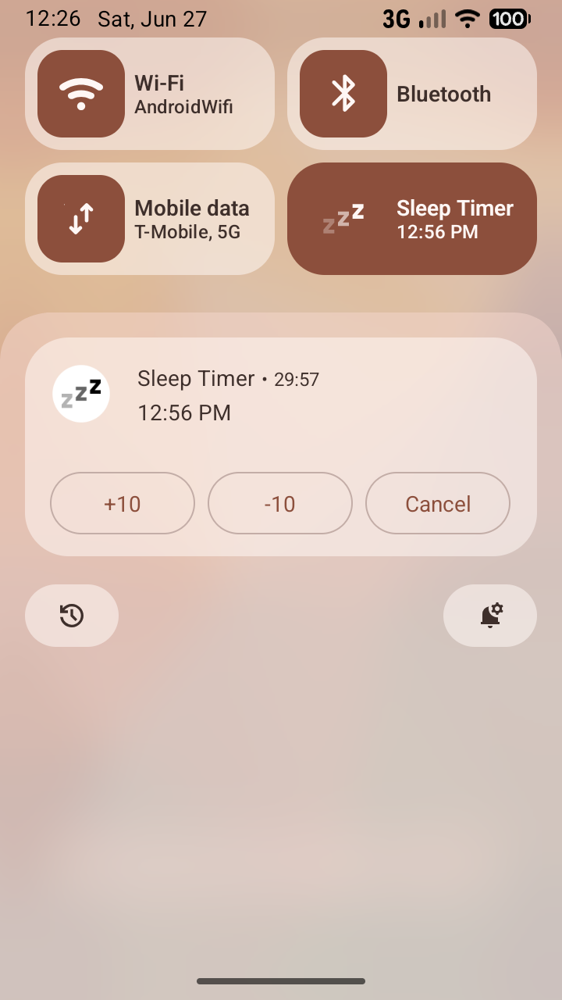

# Sleep Timer

[](https://github.com/SimonMarquis/SleepTimer/actions/workflows/android.yml)
[](https://play.google.com/store/apps/details?id=fr.smarquis.sleeptimer)
[](https://f-droid.org/en/packages/fr.smarquis.sleeptimer/)

| Quick Settings Tile | Notification |
|---|---|
|  |  |

Sleep Timer helps you fall asleep while listening to music or podcasts.  
When the timer stops, audio playback is gradually lowered then paused.

#### Usage

1. Add the Tile in the Quick Settings panel.
2. Tap the Tile to start a timer.
3. Extend, reduce or cancel the timer with the notification actions.

__Note:__ Don't look for a launcher icon, this app only provides a Quick Settings Tile.

#### Automation

You can trigger the Sleep Timer with tools like [Tasker](https://play.google.com/store/apps/details?id=net.dinglisch.android.taskerm) or by using `adb` commands:

- Start the timer
  ```bash
  adb shell am broadcast -a fr.smarquis.sleeptimer.action.START -n fr.smarquis.sleeptimer/.SleepActionReceiver
  ```
- Start the timer with custom duration (10 min)
  ```bash
  adb shell am broadcast -a fr.smarquis.sleeptimer.action.START -n fr.smarquis.sleeptimer/.SleepActionReceiver --el extras:duration 600
  ```
- Update the timer (-1 min)
  ```bash
  adb shell am broadcast -a fr.smarquis.sleeptimer.action.UPDATE -n fr.smarquis.sleeptimer/.SleepActionReceiver --el extras:duration -60
  ```
- Stop the timer
  ```bash
  adb shell am broadcast -a fr.smarquis.sleeptimer.action.STOP -n fr.smarquis.sleeptimer/.SleepActionReceiver
  ```
- Increment (default +10 min)
  ```bash
  adb shell am broadcast -a fr.smarquis.sleeptimer.action.INCREMENT -n fr.smarquis.sleeptimer/.SleepActionReceiver
  ```
- Decrement (default -10 min)
  ```bash
  adb shell am broadcast -a fr.smarquis.sleeptimer.action.DECREMENT -n fr.smarquis.sleeptimer/.SleepActionReceiver
  ```

#### APIs

- [Tile](https://developer.android.com/reference/android/service/quicksettings/Tile.html) and [TileService](https://developer.android.com/reference/android/service/quicksettings/TileService): Quick Settings Tile
- [Notification.Builder.setTimeoutAfter(durationMs)](https://developer.android.com/reference/android/app/Notification.Builder#setTimeoutAfter(long)): set notification timeout.
- [Notification.Builder.setDeleteIntent(intent)](https://developer.android.com/reference/android/app/Notification.Builder#setDeleteIntent(android.app.PendingIntent)): set deletion action.
- [AudioManager.adjustStreamVolume(STREAM_MUSIC, ADJUST_LOWER, flags)](https://developer.android.com/reference/android/media/AudioManager#adjustStreamVolume(int,%20int,%20int)): lower media volume.
- [AudioManager.setStreamVolume(STREAM_MUSIC, index, flags)](https://developer.android.com/reference/android/media/AudioManager#setStreamVolume(int,%20int,%20int)): restore initial volume.
- [AudioManager.dispatchMediaKeyEvent(KeyEvent)](https://developer.android.com/reference/android/media/AudioManager#dispatchMediaKeyEvent(android.view.KeyEvent)): sends a simulated key event for a media button.

> [!IMPORTANT]  
> Android 17 introduced [Background audio hardening](https://developer.android.com/about/versions/17/changes/bg-audio) which prevents calling `AudioManager.adjustStreamVolume(streamType, direction, flags)` from a background thread.  
> And the system does not allow `PendingIntent` used in `Notification.Builder.setDeleteIntent(intent)` to reference a foreground `Service`.  
> Therefore, an alarm must be scheduled at a precise time to trigger such foreground `Service` and pause audio playback.
> - [AlarmManager.setExactAndAllowWhileIdle(type, triggerAtMillis, PendingIntent)](https://developer.android.com/reference/android/app/AlarmManager#setExactAndAllowWhileIdle(int,%20long,%20android.app.PendingIntent)): schedule a system alarm.

# License

    Copyright 2020 Simon Marquis

    Licensed under the Apache License, Version 2.0 (the "License");
    you may not use this file except in compliance with the License.
    You may obtain a copy of the License at

       http://www.apache.org/licenses/LICENSE-2.0

    Unless required by applicable law or agreed: in writing, software
    distributed under the License is distributed on an "AS IS" BASIS,
    WITHOUT WARRANTIES OR CONDITIONS OF ANY KIND, either express or implied.
    See the License for the specific language governing permissions and
    limitations under the License.
